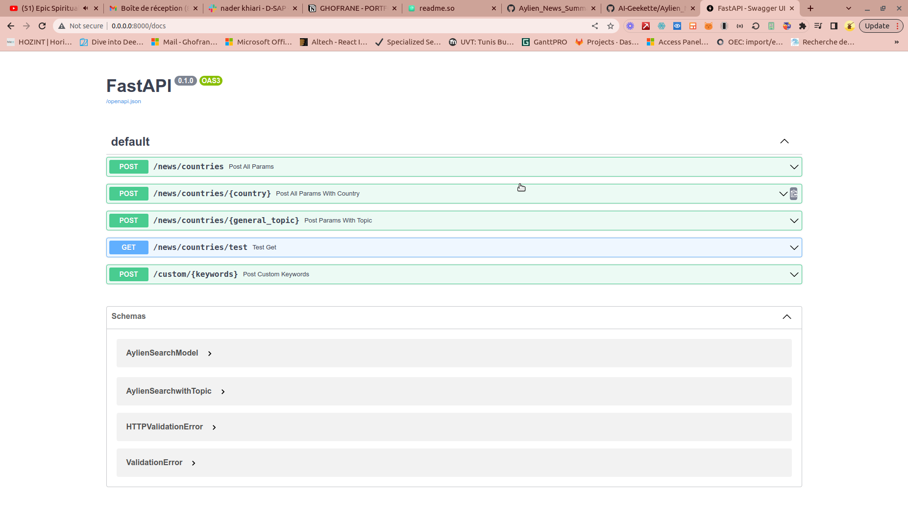

# Aylien News Summarizer
In this project, we consume news data from Aylien API (https://aylien.com/)
with FastAPI. We use OpenAI GPT3 model to summarize the returned news about a certain topic.
For the demo, we use a simple streamlit app to type in a keyword for news search, and we obtain the original news text with their respective summaries.
This project is still subject to improvements in summary task and demo app UI.
I invite you to explore the external Aylien API as I find it well structured and of much interest to explore.


# Demo
[video_demo](./media/aylien_news_demo.mp4.mp4)

## Run Locally

Clone the project

```bash
  git clone https://github.com/AI-Geekette/Aylien_News_Summarize.git
```

Go to the project directory

```bash
  cd Aylien_News_Summarize
```

Create a python virtual env

```bash
  python3 -m venv alyenapp
  source ./aylienapp/bin/activate
```
Install dependencies

```bash
  cd aylien_app
  pip3 install -r aylien_requirements.txt

```

Add the following to the project stucture

```bash
  mkdir aylien_env_settings
  cd aylien_env_settings
  touch .env.dev
```

Open the .env.dev file and add AYLIEN API ID and KEY plus OPENAI API KEY

You can either run the FastAPI with command:
```bash
uvicorn main:app --reload
```

Or you can get the service up by running
```bash
docker-compose up -d --build
```

To check that the FastAPI is up and running
```bash
docker ps
```

To stop the docker-compose service
```bash
docker-compose stop \\ stops all services
docker-compose stop <service-name> \\stops specific service only
```

Then you can run the demo with Streamlit
```bash
streamlit run ui_streamlit.py
```


## Documentation

This api is built with the MVC architecture.  

The functions that run the query to the external Aylien API is decoupled in aylien_search_utilities folder.

In the controllers folder, we implement functions that are called by each endpoint .

App routes: 

/countries/  Gets news about a prefixed list of countries

/countries/{country} Gets news about the specified country in the parameter

/countries/{general_topic} Gets news related a specific topics such as Economy, Politics, etc

/countries/test For testing

/custom/{keywords} Gets news about a specific keyword like "crypto" or "bitcoin" :smiley:

